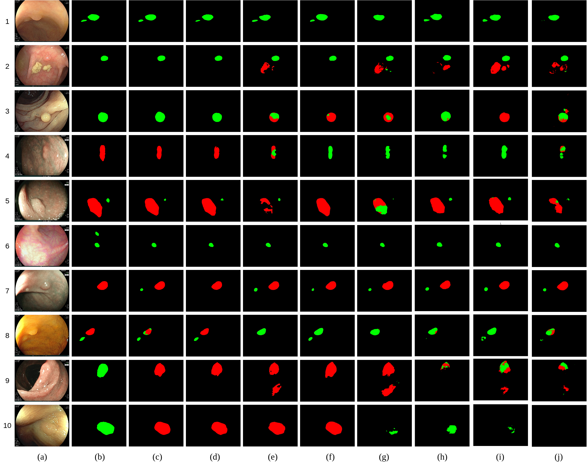

# BlazeNeo: Blazing fast polyp segmentation and neoplasm detection

This repository provides code for paper "***BlazeNeo: Blazing fast polyp segmentation and neoplasm detection***" in IEEE Access, vol. 10, pp. 43669-43684, 2022.

## Features

* **Real-time Speed**: Our method, name BlazeNeo, can efficiently perform polyp segmentation and neoplasm detection from polyp videos with real-time speed (~81.5 FPS) on a single NVIDIA Tesla V100 GPU.
* **Cutting-edge Performance**: Extensive experiments on the newly collected NeoPolyp dataset and comparisons to existing models. Moreover, we measure model latency and throughput on dedicated hardware in a setting similar to a real-life deployment.


## Framework overview

## Tutorials

### Installation
Download our public dataset [BKAI-IGH NeoPolyp-Small](https://www.kaggle.com/c/bkai-igh-neopolyp/) for your own experiments.

```
pip install -r requirements.txt
```

### Model training
```
python train.py
```

### Model evaluation
```
python eval.py
```

### Prediction
```
python infer.py
```

## Quantitative comparison

Performance metrics on the NeoPolyp-Clean test set for ColonSegNet, U-Net, DDANet, DoubleU-Net, PraNet, HardNet-MSEG, NeoUNet and BlazeNeo.

|     Method      | Dice<sub>seg</sub> | Dice <sub> non </sub> | Dice <sub> neo </sub> |   FPS    |   Parameters   |  GFLOPs   |
| :-------------: | :----------------: | :-------------------: | :-------------------: | :------: | :------------: | :-------: |
|   ColonSegNet   |       0.738        |         0.505         |         0.732         |   44.9   |   5,010,000    |   64,84   |
|      U-Net      |       0.785        |         0.525         |         0.773         |   69.6   |   31,043,651   |  103,59   |
|     DDANet      |       0.813        |         0.578         |         0.802         |   46.2   |   6,840,000    |   31,45   |
|   DoubleU-Net   |       0.837        |         0.621         |         0.832         |   43.2   |   18,836,804   |   83,62   |
|  HarDNet-MSEG   |       0.883        |         0.659         |         0.869         |   77.1   |   17,424,031   |   11,38   |
|     PraNet      |       0.895        |         0.705         |         0.873         |   55.6   |   30,501,341   |   13,11   |
|     NeoUNet     |     **0.911**      |       **0.720**       |       **0.889**       |   68.3   |   38,288,397   |   39,88   |
| BlazeNeo (Ours) |       0.904        |         0.717         |         0.885         | **81.5** | **17,143,324** | **11.06** |


## Qualitative comparison

Qualitative comparison of the proposed method with other baseline methods: (a) image, (b) ground truth, (c) BlazeNeo (Ours), (d) NeoUNet, (e) PraNet, (f) HarDNet-MSEG, (g) UNet, (h) Double U-Net, (i) DDANet, and (j) ColonSegNet.

## Ackowledgement

This work was funded by Vingroup Innovation Foundation (VINIF) under project code VINIF.2020.DA17. We thank IGH for collecting and annotating the data.

## Cite
Please cite our work if you find it useful:
```
@ARTICLE{blazeneo2022,
  author={An, Nguyen S. and Lan, Phan N. and Hang, Dao V. and Long, Dao V. and Trung, Tran Q. and Thuy, Nguyen T. and Sang, Dinh V.},
  journal={IEEE Access}, 
  title={BlazeNeo: Blazing Fast Polyp Segmentation and Neoplasm Detection}, 
  year={2022},
  volume={10},
  pages={43669-43684}
}
```

## FAQ

If you want to improve the usability or any piece of advice, please feel free to contact me directly (syan.vn@gmail.com)
